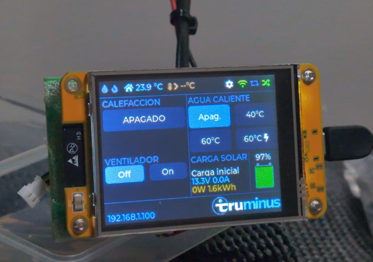
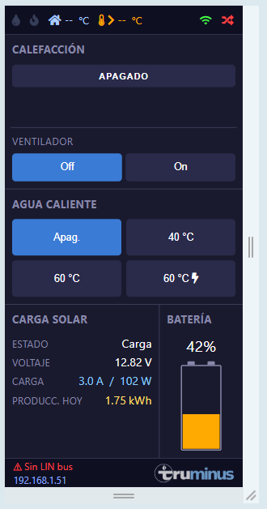
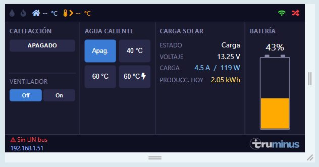

# TruMinus — CYD edition

A fork of [olivluca/TruMinus](https://github.com/olivluca/TruMinus) that turns an
**ESP32-2432S028R "Cheap Yellow Display" (CYD)** into a full replacement for the
Truma **CP Plus** control panel of a **Truma Combi D** heater, with a built-in
2.8" touchscreen, web UI and Bluetooth integration with the motorhome's solar
charger and battery BMS.

The story behind this fork — why I built it, the dead ends, the custom PCB and
the 3D-printed enclosure — is written up here:
**[Advanced motorhome Truma control panel — a custom ESP32 CYD journey](https://www.victordorado.es/2026/05/05/advanced-motorhome-truma-control-panel-a-custom-esp32-cyd-journey/)**.



> This software is not provided, endorsed, supported, or sponsored by Truma.
> See the [LICENSE](LICENSE) — no warranty of any kind.

---

## Relation to the upstream projects

This repository started as a fork of two sibling projects by **olivluca**:

- **[TruMinus](https://github.com/olivluca/TruMinus)** — ESP32 firmware that
  emulates a CP Plus on the LIN bus and exposes the Combi D over MQTT, a small
  web UI and a serial CLI. All of the LIN protocol work, the MQTT topic layout,
  the Home Assistant autodiscovery and the original web interface come from
  there.
- **[TrumaDisplay](https://github.com/olivluca/TrumaDisplay)** — a separate
  CYD-based MQTT client that talks to a TruMinus instance and renders a touch
  UI built with Squareline Studio.

This fork **merges both ideas into a single firmware** that runs on the CYD:
the ESP32 acts as the LIN master *and* drives the touchscreen directly, with no
second device or MQTT round-trip required between the controller and the
display. **MQTT has been dropped on the CYD build** to free up RAM (the NimBLE
stack plus LVGL plus the WebSocket server already leave very little headroom on
the WROOM-32); the remaining ways to talk to the device are the touchscreen,
the embedded web UI and the serial CLI.

If you have a non-CYD board (GOOUUU C3, Wroom32, C3 Supermini), the original
TruMinus is the better starting point — this fork keeps the build flags for
those boards working, but the CYD path is the one I actively use and test.

---

## What's new vs. upstream TruMinus

Hardware target

- **Primary board: ESP32-2432S028R (CYD)** with ILI9341 320×240 TFT and XPT2046
  resistive touch. LIN bus on `TX=GPIO27`, `RX=GPIO22` (the only pins still
  free on this board).
- External **AM2301 / DHT22** outdoor temperature sensor on `GPIO17`
  (repurposed from the on-board RGB LED blue channel).
- Custom sandwich-style PCB and a 3D-printed enclosure designed to drop into
  the original CP Plus opening of the motorhome — see the blog post above.

On-device touchscreen UI (LVGL)

- Four-panel landscape layout: heating, fan, hot water, and a combined
  solar/battery panel.
- Boiler modes (off / 40 °C / 60 °C / 60 °C boost), heating fan modes, energy
  selector (Gas / Gas+Elec 850 W / Gas+Elec 1700 W / Elec 850 W / Elec 1700 W),
  room and water setpoints, three-state tint and fire indicators, error modal.
- First-boot guided setup screens for **WiFi**, **touch calibration**,
  **screen timeout** (30 s / 1 min / 3 min / never with dim warning +
  wake-overlay) and **language** (Spanish / English, persisted in NVS).

Bluetooth integrations (off-grid telemetry)

- **Victron SmartSolar MPPT** via the BLE *Instant Readout* protocol (active
  scan, AES-CTR decryption, fixed for newer firmware revisions). Shows state,
  battery voltage, charge current and PV power.
- **Ultimatron LiFePO4 BMS** via its GATT protocol. Shows SOC as a vertical
  battery icon with colour-coded fill.
- BLE peer MACs and the Victron encryption key are entered from the on-screen
  *Carga solar* setup and stored in NVS.
- **BLE is disabled by default on CYD builds** (`-DBLE` opt-in). The NimBLE
  stack costs ~60 KB of heap, which on the WROOM-32 leaves too little for
  concurrent HTTP requests and triggers OOM aborts. Without `-DBLE` the
  firmware still builds and the UI is fed with simulated data so the panels
  remain testable.

Web interface

- Rebuilt to mirror the CYD layout, including the solar/battery panel.
- Static assets are **embedded into the firmware** (`scripts/compress_fs.py`
  → `src/webfiles.h`) instead of being served from LittleFS. This avoids a
  class of OOM crashes that affected the original webserver on WROOM modules,
  but it means a **firmware reflash is required** after any change under
  `data/` (`uploadfs` alone is not enough).
- Thread-safe WebSocket queue with a client/queue cap, JSON built without heap
  fragmentation, and 300 ms debounce on user actions.

Protocol & robustness

- Frame 0x21 / 0x22 (CP Plus D) parsing for room temperature, water heating
  state, water temperature and rolling counter.
- Persistent setpoints (heating / boiler / fan) across reboots in NVS.
- Multi-language i18n with first-boot selector (`src/i18n.{hpp,cpp}`).
- Error / warning modal in both web and CYD UIs with class-aware reset
  handling.
- LIN bus task pinned to Core 0 so blocking serial reads can't starve WiFi /
  MQTT / LVGL on Core 1.

---

## Build

This project uses **PlatformIO**. See [`CLAUDE.md`](CLAUDE.md) for the full
architecture notes — the short version:

```bash
# firmware
pio run --target upload

# web assets are embedded — reflash the firmware after editing data/
pio run --target upload
```

Pick a board by uncommenting the matching `build_flags` block in
`platformio.ini`:

| Board                     | Flag             | Notes                                  |
|---------------------------|------------------|----------------------------------------|
| **CYD** (ESP32-2432S028R) | `-DCYD`          | Primary target of this fork            |
| GOOUUU ESP32 C3           | `-DGOOUUUC3`     | Upstream default                       |
| Wroom32                   | `-DWROOM32`      |                                        |
| C3 Supermini              | `-DC3SUPERMINI`  | Needs `-DARDUINO_USB_CDC_ON_BOOT=1`    |

On CYD builds WiFi is configured from the touch UI on first boot and stored in
NVS, so no extra files are needed. For the legacy non-CYD boards the upstream
[`wifi_config.h`](https://github.com/olivluca/TruMinus) convention still
applies.

LIN-bus wiring follows the [`inetbox.py`](https://github.com/danielfett/inetbox.py)
"Hardware requirements" notes (transceiver with `LIN`/`INH` bridged, master on
the ESP32 side). On CYD use `TX=GPIO27`, `RX=GPIO22`; on the other boards the
upstream defaults (`TX=19`, `RX=18`, or `6/7` on C3 Supermini) still apply.

---

## Interfaces

### Touchscreen (CYD only)

Built with [esp32-smartdisplay](https://github.com/rzeldent/esp32-smartdisplay)
and LVGL. Top bar shows outdoor temperature, a settings button, and WiFi / LIN
status dots; the status bar shows `SSID  IP` and the latest status message.
Settings (WiFi, solar/battery BLE, timeout, language) are reachable from the
`⚙ Conf.` button.

### Web UI

Same 4-panel layout as the device, served from embedded flash and synced over
WebSocket. Reachable at `http://truminus.local/` once the device is on the
network.




### Serial CLI

Connect at 115200/N/8/1 and type `help` for the list of commands. Setpoints
made from the CLI are mirrored to the web and CYD UIs.

---

## Credits

- **[olivluca/TruMinus](https://github.com/olivluca/TruMinus)** — original
  CP Plus emulator, LIN protocol work and web UI. Everything in this fork
  stands on top of that work.
- **[olivluca/TrumaDisplay](https://github.com/olivluca/TrumaDisplay)** —
  reference for a CYD-based UI talking to a TruMinus controller; the
  inspiration for merging controller and display into one device.
- **[danielfett/inetbox.py](https://github.com/danielfett/inetbox.py)** —
  hardware-side reference for the LIN transceiver wiring.
- **[chrisj7903/Read-Victron-advertised-data](https://github.com/chrisj7903/Read-Victron-advertised-data)**
  — Victron Instant Readout reference implementation.
- **[sergkh/node-ultimatron-battery](https://github.com/sergkh/node-ultimatron-battery)**
  — Ultimatron BMS GATT protocol reference.

## License

GPL — see [LICENSE](LICENSE).
