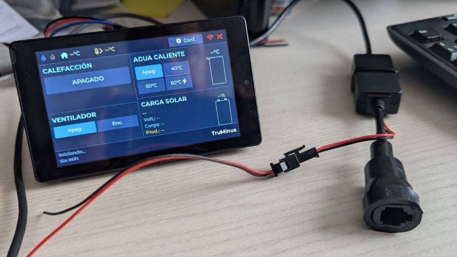

# TruMinus

Firmware for the **JC4880P443C** board (ESP32-P4) that emulates a Truma CP Plus D
control unit and manages a **Truma Combi D** heater over the LIN bus.

Control surfaces: a physical 800×480 LCD with capacitive touch, a WebSocket web
UI and a serial CLI.  Solar charge data (Victron BLE) and battery SOC
(Ultimatron BLE) are surfaced on both the LCD and the web UI, along with the
**actual boiler water temperature** — a reading the stock Truma CP Plus does
not expose.

For remote access through home/RV CGNAT, the firmware can dial out to a
companion Node.js mini-app (`server/`, runs on any VPS or a Plesk-managed
subdomain like `tunnel.yourdomain.com`) and tunnel browser traffic over WSS —
no port forwarding, no DDNS, just a domain you control.

> This software is not provided, endorsed, supported, or sponsored by Truma.
> See [LICENSE](LICENSE) — no warranty of any kind.

---

## Hardware

| | |
|---|---|
| **Board** | JC4880P443C (ESP32-P4-WROOM, dual-core RISC-V @ 400 MHz) |
| **Flash / PSRAM** | 16 MB QIO / 32 MB HEX |
| **Display** | 4.3" ST7701 RGB panel, 800×480 landscape |
| **Touch** | GT911 capacitive, I2C |
| **Connectivity** | WiFi + BLE 5 via co-processor ESP32-C6 (SDIO) |
| **Upload** | USB-CDC on `/dev/ttyACM0` (no USB bridge needed) |

LIN bus pins and the AM2301/DHT22 external temperature sensor pin are being
finalised on the new board — always check `main/main.cpp` and `main/lin_driver.cpp`
for current assignments rather than relying on this document.

---

## Prerequisites

**ESP-IDF 6.0.1** (the `release/v6.0` branch). PlatformIO is not used — the build
is driven directly by `idf.py`.

```bash
# Clone IDF (once per machine)
git clone --branch release/v6.0 \
    https://github.com/espressif/esp-idf.git ~/esp/esp-idf

# Install the ESP32-P4 toolchain (once per machine)
cd ~/esp/esp-idf
./install.sh esp32p4
```

---

## Building

Source the IDF environment **once per terminal session**, then use `make` or
`idf.py` directly:

```bash
. ~/esp/esp-idf/export.sh

make               # build
make flash         # build + flash  (PORT defaults to /dev/ttyACM0)
make monitor       # serial monitor at 115200
make flash-monitor # flash then open monitor
make clean         # idf.py fullclean

PORT=/dev/ttyUSB0 make flash   # override port if needed
```

Equivalent `idf.py` commands if you prefer them directly:

```bash
idf.py build
idf.py -p /dev/ttyACM0 flash monitor
idf.py fullclean
```

Web assets under `data/` are compiled into the firmware binary by
`scripts/compress_fs.py` (runs automatically at cmake configure time). A
**firmware reflash is required** after any change to `data/` — there is no
separate filesystem partition.

---

## VSCode

Install the **ESP-IDF extension** (`espressif.esp-idf-extension`) — it provides
build, flash and monitor buttons without any additional wrapper tooling. The
`.vscode/extensions.json` in this repo will suggest it automatically when you
open the folder.

After installing the extension, create your local settings file from the
template:

```bash
cp .vscode/settings.json.template .vscode/settings.json
# then edit settings.json and replace YOUR_USER with your username
```

`settings.json` is gitignored so each developer keeps their own paths locally.

After the first successful `make build` (or `idf.py build`), the file
`build/compile_commands.json` is generated and IntelliSense will pick it up
automatically.

---

## Architecture

```
Truma Combi D ←→ LIN transceiver ←→ ESP32-P4 UART
                    ↕
MQTT broker / WebSocket clients / Serial CLI / Touch UI
                    ↕
Victron BLE (solar) / Ultimatron BLE (battery)
```

Key source files in `main/`:

| File | Purpose |
|------|---------|
| `main.cpp` | `app_main` entry point (currently a display-only stub) |
| `p4display.cpp/.hpp` | LVGL UI for the 800×480 LCD |
| `lin_driver.cpp/.hpp` | Half-duplex LIN driver over ESP-IDF UART |
| `trumaframes.cpp/.hpp` | LIN protocol layer — frame parsing / building |
| `settings.cpp/.hpp` | Setpoint abstraction (heating / fan / boiler / energy) |
| `webserver.cpp/.hpp` | HTTP static serving + WebSocket JSON handler |
| `victronble.cpp/.hpp` | Victron SmartSolar BLE (Instant Readout protocol) |
| `ultimatronble.cpp/.hpp` | Ultimatron LiFePO4 BMS BLE (GATT) |
| `i18n.cpp/.hpp` | `TK` enum + `t(TK::KEY)` — Spanish/English, persisted in NVS |

Build system notes and known gotchas are in
[`.claude/skills/pio-idf-p4/SKILL.md`](.claude/skills/pio-idf-p4/SKILL.md).

---

## Public access via tunnel (`server/`)

The ESP sits behind home/RV CGNAT in most installs, so it isn't reachable
from the outside.  `server/app.js` is a small Node.js bridge you run on
any public-IP server.  The firmware dials out to it over WSS and the
bridge muxes browser HTTP/WS traffic back to the device's local
`esp_http_server`.  See [`CLAUDE.md`](CLAUDE.md#wss-reverse-tunnel--plesk-bridge)
for the wire protocol.

### What you need
- A public domain (e.g. `tunnel.example.com`) pointing at your server.
- TLS — Let's Encrypt is fine.
- **Node.js ≥ 18**.
- A shared secret for `TUNNEL_TOKEN`.  Generate one with:
  ```bash
  openssl rand -hex 8
  ```

### Install on Plesk

1. **Domain & SSL.** Create the (sub)domain in Plesk and issue a Let's
   Encrypt certificate (Plesk → *SSL/TLS Certificates*).  Enable
   "Redirect from HTTP to HTTPS".
2. **Node.js component.** Plesk → *Tools & Settings → Updates → Add/Remove
   Components* → install **Node.js support** if not already there.
3. **Deploy the code.** Pull the repo on the server, or upload just the
   `server/` folder.  The simplest path is Plesk's *Git* extension:
   - *Add Repository* → point at this repo, deploy to e.g. `/httpdocs`.
   - *Repository Settings* leaves no extra deploy actions needed —
     after the first pull, click **NPM install** in the Node.js panel
     (Plesk's bundled `npm`; using `npm` directly from SSH fails because
     it isn't on the deploy shell's PATH).
4. **Enable Node.js.**  Plesk → your domain → *Node.js*:

   | Field | Value |
   |---|---|
   | Node.js version | 18.x or newer |
   | Application Mode | `production` |
   | Application Root | `/httpdocs/server` (where `app.js` lives) |
   | Application Startup File | `app.js` |
   | Document Root | `/httpdocs` (Plesk requires it; runtime ignores it) |

   Click **Enable Node.js**.
5. **Env vars.**  Same screen, *Custom environment variables*:

   | Variable | Value |
   |---|---|
   | `TUNNEL_TOKEN` | the secret from above |
   | `NODE_ENV` | `production` |

   `PORT` is injected by Passenger automatically — don't set it.  Click
   **Restart App** after saving.
6. **Verify.**  From outside:
   ```bash
   curl -i https://tunnel.example.com/
   # HTTP/2 502   tunnel offline    ← good: server is up, no ESP yet
   ```
   Plesk → *Node.js → Show logs* should print `tunnel: listening on :<PORT>`.

### Install on a plain Linux server (systemd)

```bash
git clone https://github.com/<your-fork>/TruMinus.git /opt/truminus
cd /opt/truminus/server
npm ci --omit=dev
```

Put a unit file at `/etc/systemd/system/truminus-tunnel.service`:

```ini
[Unit]
Description=TruMinus WSS reverse tunnel bridge
After=network-online.target
Wants=network-online.target

[Service]
Type=simple
User=truminus
WorkingDirectory=/opt/truminus/server
Environment=NODE_ENV=production
Environment=PORT=3000
Environment=TUNNEL_TOKEN=<paste-secret-here>
ExecStart=/usr/bin/node app.js
Restart=on-failure
RestartSec=5
# Hardening — adjust to taste
NoNewPrivileges=true
PrivateTmp=true
ProtectSystem=strict
ProtectHome=true

[Install]
WantedBy=multi-user.target
```

Then:

```bash
sudo useradd --system --home /opt/truminus --shell /usr/sbin/nologin truminus
sudo chown -R truminus:truminus /opt/truminus/server
sudo systemctl daemon-reload
sudo systemctl enable --now truminus-tunnel
sudo journalctl -u truminus-tunnel -f
```

The app listens on `$PORT` over plain HTTP; terminate TLS in front of it
with nginx/Caddy/Traefik and add the standard WebSocket upgrade headers.
Example nginx block:

```nginx
location / {
    proxy_pass http://127.0.0.1:3000;
    proxy_http_version 1.1;
    proxy_set_header Upgrade $http_upgrade;
    proxy_set_header Connection $connection_upgrade;
    proxy_set_header Host $host;
    proxy_read_timeout 1h;          # keep the ESP control WS alive
}
```

### Configure the device

On the TruMinus LCD: **[⚙ Config]** → **Tunnel**:
- **Domain**: bare hostname, e.g. `tunnel.example.com` (no scheme, no
  path — the firmware composes `wss://<domain>/tunnel?token=…` itself).
- **Token**: the same value as `TUNNEL_TOKEN` on the server.
- **Enable switch → ON**
- Save.

The cloud icon in the top bar blinks while the WSS handshake is in
flight, turns solid blue when up, and goes red after
3 consecutive disconnects without a successful connect.

---

## Relation to upstream

This project started as a fork of **[olivluca/TruMinus](https://github.com/olivluca/TruMinus)**
(CP Plus emulator + MQTT/web UI) and **[olivluca/TrumaDisplay](https://github.com/olivluca/TrumaDisplay)**
(CYD touch UI), merging both into a single firmware. The LIN protocol work, MQTT
topic layout, Home Assistant autodiscovery and the original web interface all come
from olivluca's work.

The previous board (ESP32-C5 / NM-CYD-C5) is preserved in the git history and in
[`.claude/skills/nm-cyd-c5/SKILL.md`](.claude/skills/nm-cyd-c5/SKILL.md).

---

## Credits

- **[olivluca/TruMinus](https://github.com/olivluca/TruMinus)** — original CP Plus emulator, LIN protocol and web UI
- **[olivluca/TrumaDisplay](https://github.com/olivluca/TrumaDisplay)** — CYD touch UI reference
- **[danielfett/inetbox.py](https://github.com/danielfett/inetbox.py)** — LIN transceiver wiring reference
- **[chrisj7903/Read-Victron-advertised-data](https://github.com/chrisj7903/Read-Victron-advertised-data)** — Victron Instant Readout reference
- **[sergkh/node-ultimatron-battery](https://github.com/sergkh/node-ultimatron-battery)** — Ultimatron BMS GATT protocol reference

## License

GPL — see [LICENSE](LICENSE).
